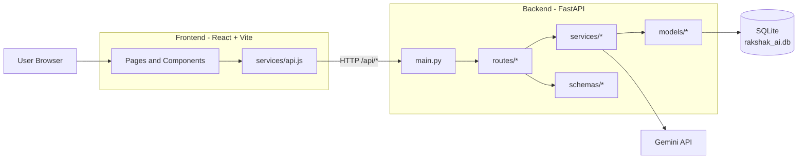
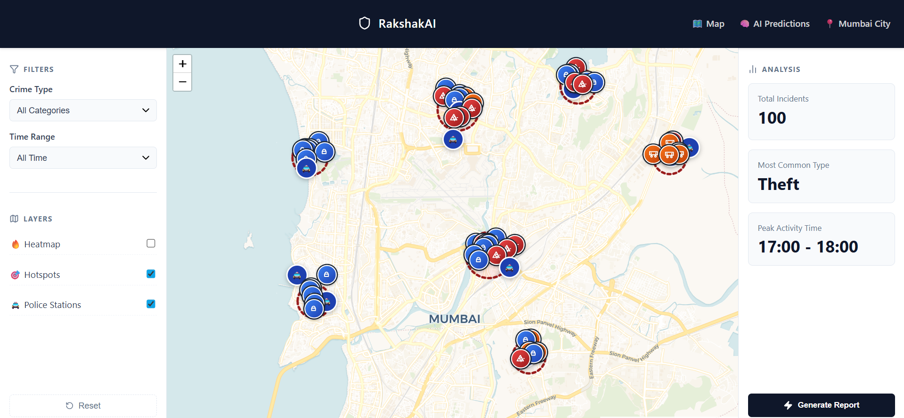
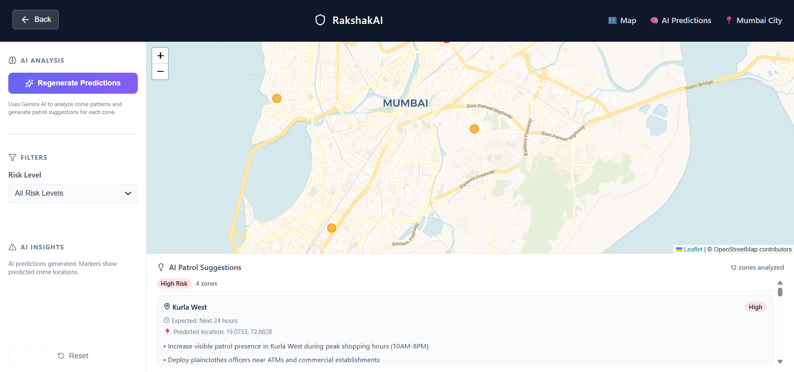

# RakshakAI

Crime Analytics and Patrol Management platform for Mumbai, built with a React frontend and FastAPI backend.

Legacy detailed docs are archived in `docs/archive/`.

## Project Info

- Purpose: visualize incidents, detect hotspots, and support patrol planning.
- Frontend: React + Vite + Leaflet (`frontend/`).
- Backend: FastAPI + SQLAlchemy + SQLite (`backend/`).
- Key modules: crimes, zones, predictions, patrol suggestions, crime stats.

## Backend Architecture

- `main.py`: app setup, CORS, router registration.
- `routes/`: endpoint handlers.
- `services/`: business logic and AI workflow.
- `models/`: SQLAlchemy entities.
- `schemas/`: request/response validation.

## Way Forward

- Add auth (JWT + roles for admin/officer).
- Replace SQLite with PostgreSQL for production.
- Add monitoring, rate limiting, and structured logs.
- Add CI PR checks (lint, build, backend smoke tests).
- Improve AI reliability with retries, quotas, and fallback visibility.

## Screenshots

### 1. Dashboard Overview

### 2. AI Predictions View

